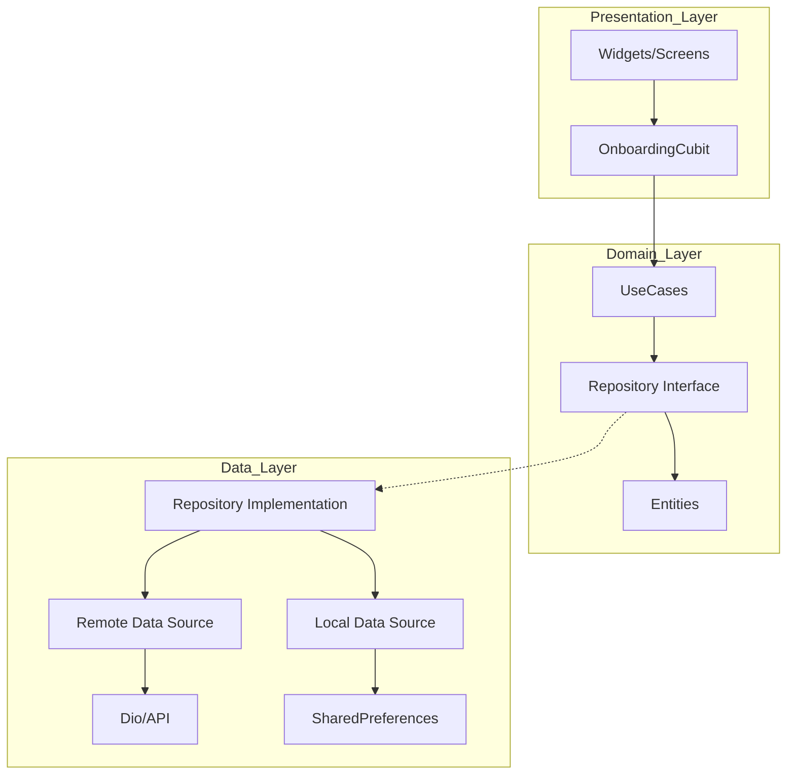

# Barq Cubit ⚡

[](https://github.com/asifali9/barq-cubit_clearn_architecture/actions)
[](https://flutter.dev)
[](https://blog.cleancoder.com/uncle-bob/2012/08/13/the-clean-architecture.html)

**Barq Cubit** is a premium, production-ready Flutter application demonstrating an elite implementation of **Clean Architecture** combined with **Domain-Driven Design (DDD)** principles and **Cubit** for robust state management.

---

## 🏗️ Architecture Matrix

The project follows a strict **Clean Architecture** pattern to ensure high maintainability, testability, and scalability.



### 🗝️ Core Principles
- **Separation of Concerns**: UI, Business Logic, and Data layers are completely decoupled.
- **Dependency Inversion**: High-level modules do not depend on low-level modules; both depend on abstractions.
- **Test-Driven Design**: Logic is extracted into UseCases and Cubits, making unit testing seamless.

---

## 🛠️ Tech Stack & Elite Tools

- **State Management**: [flutter_bloc](https://pub.dev/packages/flutter_bloc) (Cubit) - Optimized for predictable state transitions.
- **Networking**: [Dio](https://pub.dev/packages/dio) with custom Interceptors and decoupled `NetworkErrorHandler`.
- **Local Storage**: [SharedPreferences](https://pub.dev/packages/shared_preferences) via an abstraction wrapper.
- **UI Components**: 
  - Custom premium design system (`AppTextField`, `AppText`, `CustomButton`).
  - [pinput](https://pub.dev/packages/pinput) for smooth OTP experiences.
- **Testing**:
  - `bloc_test` for Cubit state verification.
  - `mocktail` for high-fidelity dependency mocking.

---

## 🚀 CI/CD Pipeline

The project features a fully automated **GitHub Actions CI** pipeline located in `.github/workflows/flutter_ci.yml`.

- **Static Analysis**: Ensures `flutter analyze` passes with zero warnings.
- **Automated Testing**: Executes the full unit test suite on every push and pull request.
- **Reliability**: guarantees that no breaking logic or UI debt reaches the `main` branch.

---

## 📱 Features

- **Onboarding Flow**: Sequential Intro screens with synchronized progress animations.
- **Smart Auth**: Mobile number validation with modal operator selection.
- **Persistence**: Remembers "First-Time" users via local data source integration.
- **Error Handling**: Graceful handling of Network and Server exceptions at the API level.

---

## ⚙️ Setup

1. **Clone the repo**:
   ```bash
   git clone https://github.com/asifali9/barq-cubit_clearn_architecture.git
   ```
2. **Install Dependencies**:
   ```bash
   flutter pub get
   ```
3. **Run Unit Tests**:
   ```bash
   flutter test
   ```
4. **Launch**:
   ```bash
   flutter run
   ```

---

> [!TIP]
> This project is designed as a blueprint for enterprise-grade Flutter applications. Every line of code follows best practices for performance and readability.
